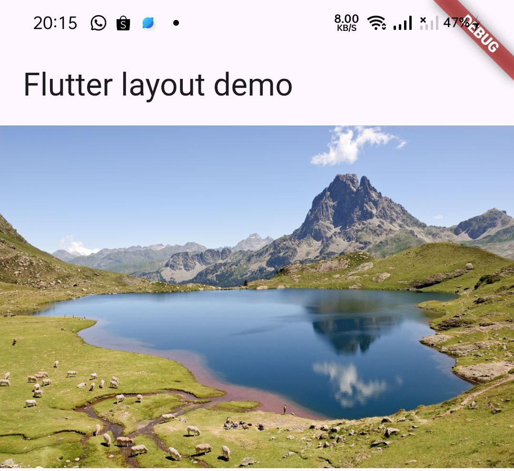
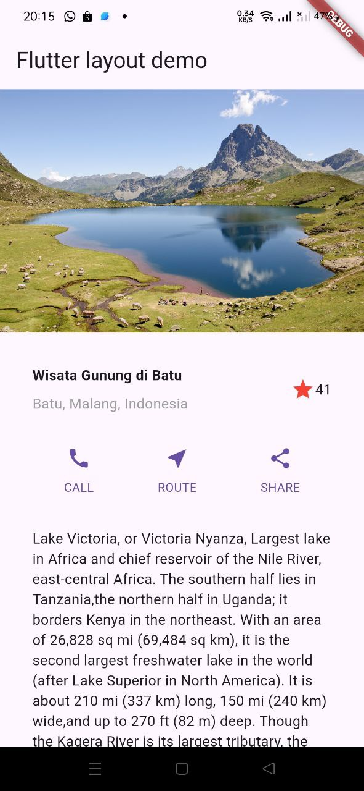

# layout_flutter

A new Flutter project.

## Documentation 
# Praktikum 1
  Soal 1
  <a> /* soal 1*/
            child: Column(
              crossAxisAlignment: CrossAxisAlignment.start,
              children: [ </a>
  Soal 2
   <a>/* soal 2*/
                Container(
                  padding: const EdgeInsets.only(bottom: 8),
                  child: const Text(
                    'Wisata Gunung di Batu',
                    style: TextStyle(
                      fontWeight: FontWeight.bold,
                    ),
                  ),
                ),
                Text(
                  'Batu, Malang, Indonesia',
                  style: TextStyle(color: Color.fromARGB(255, 158, 158, 158)),
                ),
              ],
            ),
          ),</a>
  Soal 3
  <a>const Icon(
            Icons.star,
            color: Colors.red,
          ),
          const Text("41"),
        ],
      ),
    ); </a> 
  Hasil :
 

# Praktikum 2
  Hasil :
 

# Praktikum 3
  Hasil :
 

# Praktikum 4
  Hasil :
 
 
  Hasil akhir:
 
